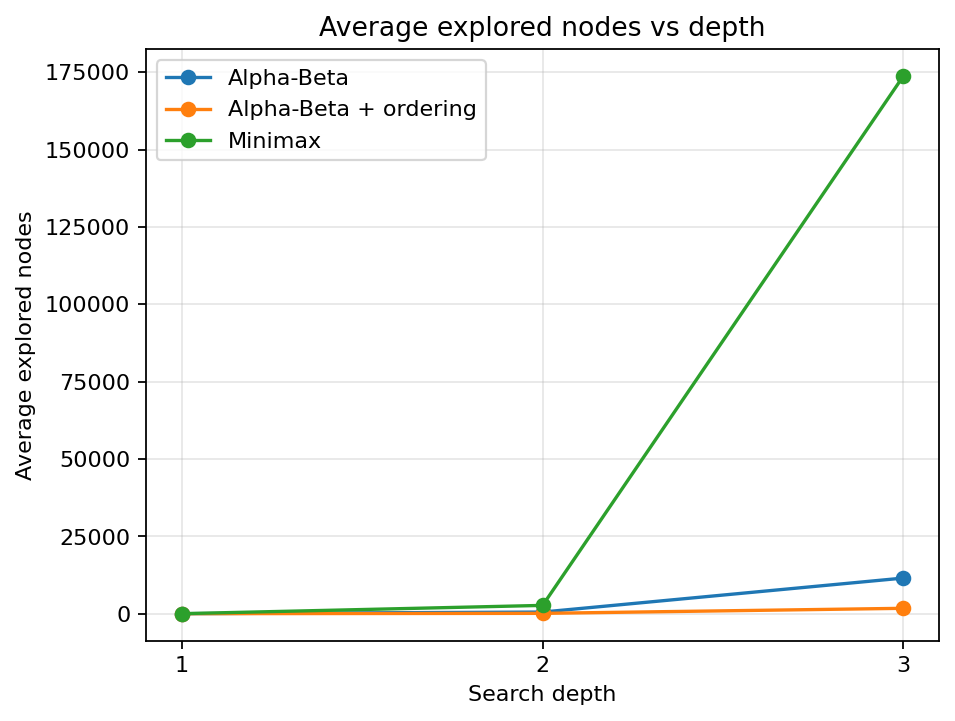
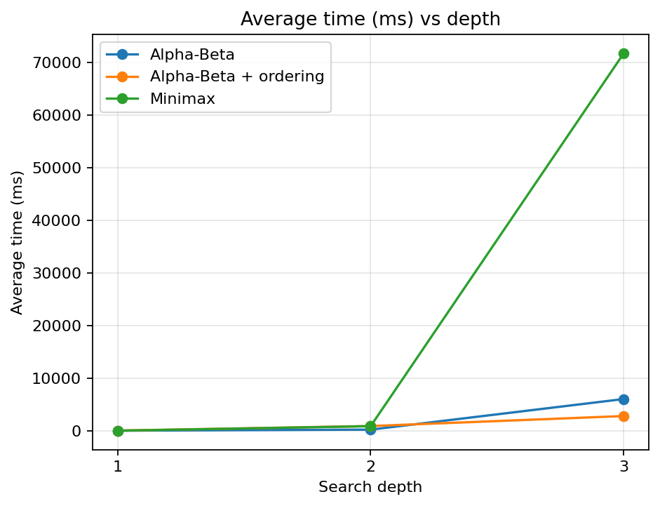
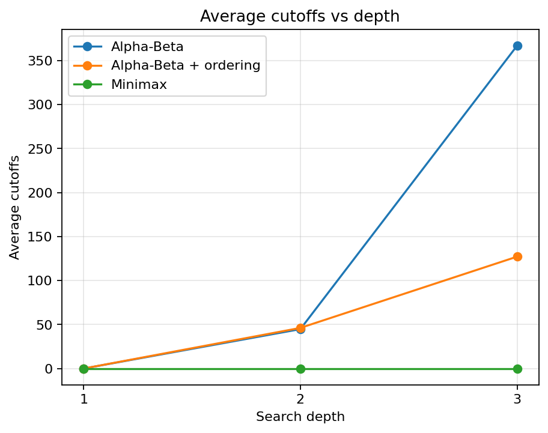

# Experiment 1 Report: Alpha-Beta Pruning Effectiveness

## 1. Objective

This experiment verifies whether Alpha-Beta pruning improves search efficiency
without changing the decision quality of Minimax.

We compare three search variants:

1. Minimax
2. Alpha-Beta without move ordering
3. Alpha-Beta with move ordering

The goal is to check:

- whether Alpha-Beta returns the same best score as Minimax;
- whether Alpha-Beta explores fewer nodes;
- whether move ordering further reduces node exploration;
- how search depth affects nodes, runtime, and cutoffs.

## 2. Controlled Conditions

To make the comparison fair, all algorithms use the same:

- board size: `15 x 15`;
- fixed test positions: `positions.py`;
- player to move for each position;
- search depths: `1, 2, 3`;
- candidate move generator: `generate_candidate_moves(board, radius=2)`;
- evaluation function: `Eval B / eval_intermediate`.

Eval B was chosen because it considers both consecutive segment length and open
ends, making it more meaningful than Eval A while still cheaper than Eval C.

The experiment uses five fixed positions:

- `P1_opening`: small opening cluster;
- `P2_midgame`: balanced midgame;
- `P3_single_threat`: one side has a three-stone threat;
- `P4_mutual_threats`: both sides have visible threats;
- `P5_complex_midgame`: denser midgame with more candidate moves.

The terminal-style board display for all five positions is saved in:

- `results/fixed_positions.txt`

## 3. Method

For each fixed position and each depth, the script runs:

```text
Minimax
Alpha-Beta without ordering
Alpha-Beta with ordering
```

Each result records:

- best move;
- best score;
- explored nodes;
- cutoffs;
- time in milliseconds;
- candidate count;
- whether score matches Minimax;
- whether move matches Minimax.

Detailed results are saved in:

- `results/search_benchmark.csv`

The aggregated summary is saved in:

- `results/search_benchmark_summary.csv`
- `results/search_benchmark_summary.md`

## 4. Correctness Check

Across all 45 benchmark rows:

- best score matches Minimax: `45 / 45`;
- best move matches Minimax: `43 / 45`.

The two move differences happen in `P4_mutual_threats` with Alpha-Beta plus
ordering at depths 2 and 3. In both cases, the best score is still identical to
Minimax:

```text
best_score = -1000000.0
```

This means Alpha-Beta preserved the evaluated decision quality. The different
best move is acceptable because multiple moves can have the same score under the
fixed evaluation function.

## 5. Summary Table

|depth|algorithm|ordering|avg_nodes|avg_time_ms|avg_cutoffs|node_reduction_vs_minimax|score_matches_minimax|move_matches_minimax|
|---|---|---|---|---|---|---|---|---|
|1|Alpha-Beta|off|48.6|13.7762|0.0|0.0|5|5|
|1|Alpha-Beta|on|48.6|24.6361|0.0|0.0|5|5|
|1|Minimax|none|48.6|12.3447|0.0|0.0|5|5|
|2|Alpha-Beta|off|573.6|214.8704|44.8|0.7897|5|5|
|2|Alpha-Beta|on|151.6|887.8744|46.2|0.9444|5|4|
|2|Minimax|none|2727.0|875.4747|0.0|0.0|5|5|
|3|Alpha-Beta|off|11555.6|6029.3894|367.0|0.9335|5|5|
|3|Alpha-Beta|on|1782.6|2795.7996|127.2|0.9897|5|4|
|3|Minimax|none|173762.8|71749.5513|0.0|0.0|5|5|

## 6. Node Exploration



The node count grows rapidly as depth increases. Minimax has the largest growth
because it explores the full search tree. Alpha-Beta without ordering reduces
the number of explored nodes significantly, especially at depth 2 and 3.

At depth 3:

```text
Minimax average nodes:             173762.8
Alpha-Beta average nodes:           11555.6
Alpha-Beta + ordering average nodes: 1782.6
```

Compared with Minimax:

- Alpha-Beta reduces nodes by about `93.35%`;
- Alpha-Beta with ordering reduces nodes by about `98.97%`.

This confirms that Alpha-Beta pruning is effective, and move ordering further
strengthens pruning.

## 7. Runtime



Runtime generally follows the same trend as explored nodes. Minimax becomes much
slower at depth 3, while Alpha-Beta remains more practical.

At depth 3:

```text
Minimax average time:              71749.5513 ms
Alpha-Beta average time:            6029.3894 ms
Alpha-Beta + ordering average time: 2795.7996 ms
```

One detail is that at depth 2, Alpha-Beta with ordering explores fewer nodes but
takes more time than Alpha-Beta without ordering. This is because ordering itself
has overhead: it evaluates candidate moves to choose a better traversal order.
At deeper depth, the pruning benefit becomes large enough to overcome that
overhead.

## 8. Cutoffs



Minimax has no cutoffs, so its cutoff count is always zero. Alpha-Beta produces
cutoffs because it stops exploring branches that cannot affect the final result.

At depth 3:

```text
Alpha-Beta average cutoffs:           367.0
Alpha-Beta + ordering average cutoffs: 127.2
```

The ordered version has fewer cutoffs but also far fewer nodes. This is not a
contradiction: better ordering can cause fewer but more impactful cutoffs earlier
in the tree.

## 9. Conclusion

The experiment supports the expected Alpha-Beta behavior:

- Alpha-Beta produced the same best score as Minimax in all tested cases.
- Alpha-Beta explored far fewer nodes than Minimax.
- Move ordering further reduced node exploration at deeper search depths.
- Search depth strongly increases the cost of Minimax, while Alpha-Beta keeps
  the search more manageable.

Therefore, Alpha-Beta pruning is effective for this Gomoku AI search task, and
move ordering is beneficial when the search depth is large enough for pruning
gains to outweigh ordering overhead.

## 10. How to Reproduce

Run the benchmark:

```bash
python experiments/experiment1_search/benchmark_search.py
```

Generate plots:

```bash
python experiments/experiment1_search/plot_search_benchmark.py
```

If plotting dependencies are missing:

```bash
python -m pip install -r requirements.txt
```
