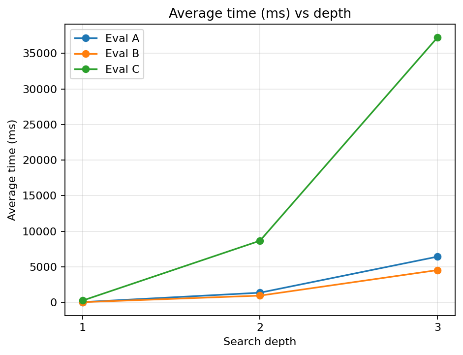
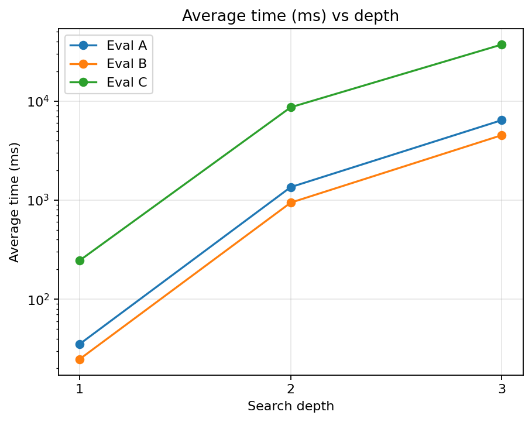
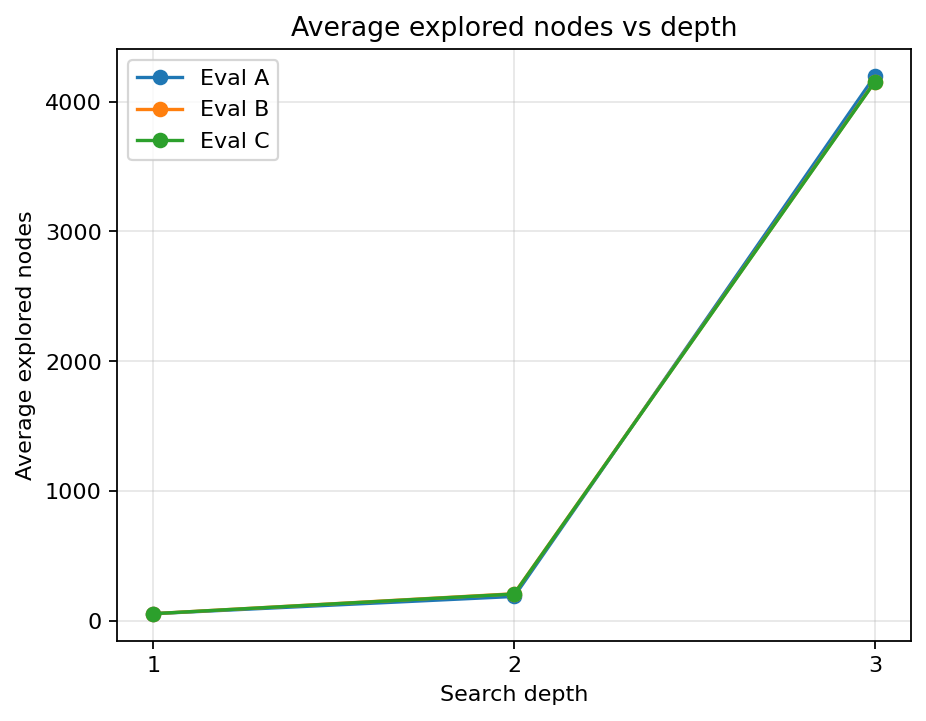
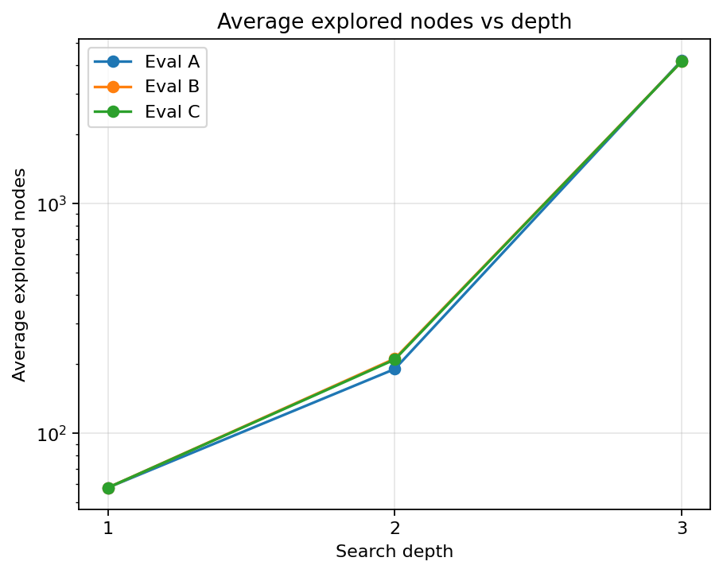
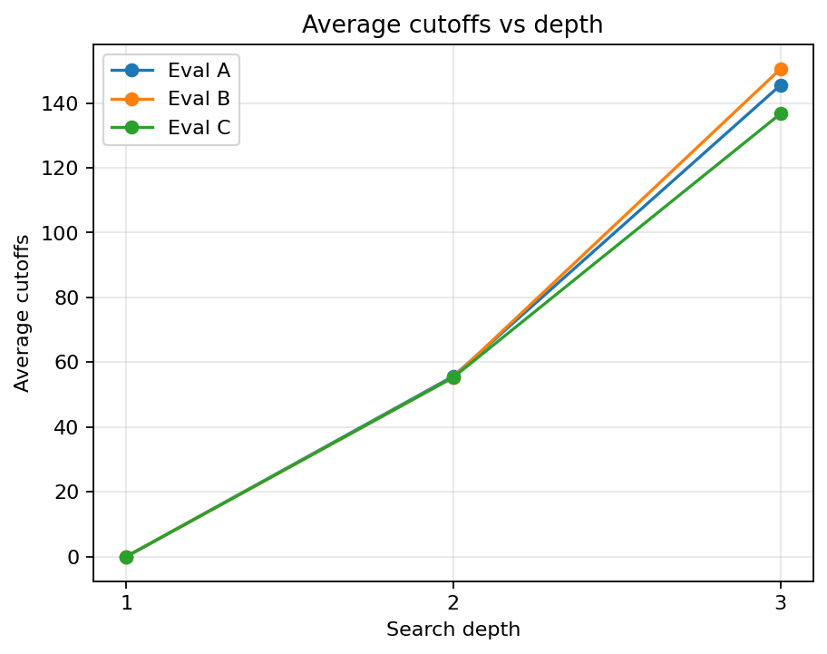

# Experiment 2 Report: Evaluation Function Comparison

## 1. Objective

Experiment 2 compares three evaluation functions under the same search
framework:

```text
Alpha-Beta pruning + move ordering
```

This experiment is not a Minimax vs Alpha-Beta comparison. Experiment 1 already
verified that Alpha-Beta pruning is effective. Here, the search framework is
fixed, and only the evaluation function changes.

This is also a fresh rerun because Eval A was modified. The old Experiment 2
folder and generated results were discarded before rebuilding this experiment,
so the CSV files, plots, and interpretation here replace the previous
Experiment 2 data.

The goal is to compare how Eval A, Eval B, and Eval C affect:

- best move selection;
- best score;
- explored nodes;
- Alpha-Beta cutoffs;
- runtime;
- candidate count;
- decision differences between evaluation functions.

## 2. Compared Evaluations

The experiment uses the current implementations in `ai/evaluation.py`.

|Evaluation|Current function|Main idea|
|---|---|---|
|Eval A|`eval_basic`|Updated basic defensive evaluation based on consecutive segments plus extra defensive open-segment scoring.|
|Eval B|`eval_intermediate`|Open / blocked shape evaluation based on segment length and open ends.|
|Eval C|`eval_advanced`|Five-cell window potential evaluation with a small center bonus.|

One important detail is that the current Eval A is not a pure minimal
consecutive-length evaluator anymore. It now calls both consecutive-segment
logic and defensive open-segment logic. Therefore, Eval A can be slower than
Eval B even though it is conceptually the basic evaluation.

## 3. Controlled Conditions

To make the comparison fair, all evaluations use the same:

- board size: `15 x 15`;
- search algorithm: Alpha-Beta + move ordering;
- candidate generator: `generate_candidate_moves(board, radius=2)`;
- search depths: `1, 2, 3`;
- fixed test positions;
- player to move for each position;
- move ordering implementation.

No depth 4 is tested. No random positions are used.

Each search result records:

- best move;
- best score;
- explored nodes;
- cutoffs;
- time in milliseconds;
- candidate count;
- whether the move is legal;
- whether the board stayed unchanged after search.

Detailed results are saved in:

- `results/evaluation_comparison.csv`

Aggregated results are saved in:

- `results/evaluation_summary.csv`
- `results/evaluation_comparison_summary.csv`
- `results/evaluation_comparison_summary.md`

Best-move comparison is saved in:

- `results/evaluation_best_move_diff.csv`

## 4. Fixed Positions

The fixed positions are defined in `positions.py` and exported as readable board
states in:

- `results/evaluation_positions.txt`

The experiment uses six fixed positions:

|Position|Purpose|
|---|---|
|E1_length_pressure|Tests immediate length pressure against more open development space.|
|E2_open_vs_blocked|Contrasts blocked longer-looking lines with open shapes.|
|E3_window_potential|Gives Eval C a chance to prefer multi-window potential.|
|E4_attack_defense|Compares attack choices with defensive potential reduction.|
|E5_center_space|Compares edge-side local extension with central development.|
|E6_complex_midgame|Uses a compact midgame with several two- and three-stone patterns.|

The average candidate count is `57.0`, and the same candidate generator is used
for all three evaluations.

## 5. Correctness Checks

The generated raw CSV contains 54 rows:

```text
6 positions x 3 depths x 3 evaluations = 54 runs
```

The rerun checks passed:

- illegal moves: `0`;
- polluted board states after search: `0`;
- tested depths: `1, 2, 3`;
- search method: `Alpha-Beta + ordering`;
- evaluations: `Eval A`, `Eval B`, `Eval C`.

This confirms that all three evaluations are called through the same search
interface and use the same candidate move generator.

## 6. Summary Table

|Depth|Evaluation|Positions|Avg time ms|Avg nodes|Avg cutoffs|Avg candidate count|
|---|---|---|---|---|---|---|
|1|Eval A|6|35.2078|58.0|0.0|57.0|
|1|Eval B|6|24.8029|58.0|0.0|57.0|
|1|Eval C|6|245.8648|58.0|0.0|57.0|
|2|Eval A|6|1353.6469|190.5|55.67|57.0|
|2|Eval B|6|943.3087|211.33|55.33|57.0|
|2|Eval C|6|8657.382|209.5|55.33|57.0|
|3|Eval A|6|6419.806|4196.17|145.5|57.0|
|3|Eval B|6|4527.5326|4154.17|150.5|57.0|
|3|Eval C|6|37228.8886|4151.83|136.67|57.0|

## 7. Runtime Comparison



Runtime increases strongly as search depth increases. Eval C is consistently
the most expensive evaluation because it scans five-cell windows and includes
more board-wide potential information.

At depth 3:

```text
Eval A average time:  6419.8060 ms
Eval B average time:  4527.5326 ms
Eval C average time: 37228.8886 ms
```

Eval C is about `8.22x` slower than Eval B at depth 3:

```text
37228.8886 / 4527.5326 ~= 8.22
```

The updated Eval A is also slower than Eval B in this rerun. This is not a
measurement error. In the current implementation, Eval A does more work than
Eval B:

```text
Eval A:
  collect_segments(player)
  collect_segments(opponent)
  collect_open_segments(player)
  collect_open_segments(opponent)

Eval B:
  collect_open_segments(player)
  collect_open_segments(opponent)
```

So although Eval A is conceptually the basic evaluation, the updated defensive
version performs more scans than Eval B.

The log-scale runtime chart is also generated for readability:



## 8. Node Comparison



All three evaluations use the same candidate generator and the same Alpha-Beta
implementation. Therefore, the node counts are much closer than the runtime
numbers.

At depth 1, node counts are identical:

```text
Eval A average nodes: 58.0
Eval B average nodes: 58.0
Eval C average nodes: 58.0
```

This is expected because depth 1 evaluates the same candidate set without
meaningful pruning.

At depth 3:

```text
Eval A average nodes: 4196.17
Eval B average nodes: 4154.17
Eval C average nodes: 4151.83
```

The difference is small. This means the main runtime gap is caused by the cost
of each evaluation call, not by Eval C exploring a much larger tree.

The log-scale node chart is also generated:



## 9. Cutoffs



Different evaluations can still affect Alpha-Beta pruning indirectly. The
evaluation score influences move ordering and alpha/beta boundary updates.

At depth 3:

```text
Eval A average cutoffs: 145.50
Eval B average cutoffs: 150.50
Eval C average cutoffs: 136.67
```

Eval B has the highest average cutoff count at depth 3 in this run. Eval C has
fewer cutoffs, but it also has roughly the same node count as Eval B. Therefore,
the lower Eval C speed is mainly explained by expensive evaluation logic rather
than by worse pruning alone.

## 10. Best Move Differences

Best-move differences are recorded in:

- `results/evaluation_best_move_diff.csv`

Across 18 position-depth cases:

```text
same best move:       11 / 18
different best move:   7 / 18
```

This is useful for the report because Experiment 2 is not only about runtime.
It also shows that different evaluation ideas can lead to different decisions
under the same search framework.

Representative cases:

|Position|Depth|Eval A move|Eval B move|Eval C move|Interpretation|
|---|---|---|---|---|---|
|E1_length_pressure|2|`7 9`|`8 8`|`8 8`|Eval A keeps the local extension, while Eval B/C prefer another shape.|
|E1_length_pressure|3|`9 6`|`9 9`|`9 9`|Deeper search still separates Eval A from Eval B/C.|
|E3_window_potential|2|`5 9`|`5 9`|`9 5`|Eval C selects a different potential-window move.|
|E5_center_space|1|`4 6`|`4 6`|`6 6`|Eval C favors central / spatial potential earlier.|
|E5_center_space|2|`4 6`|`6 6`|`6 6`|Eval B/C agree on the development move while Eval A extends locally.|
|E5_center_space|3|`6 6`|`9 9`|`4 6`|All three evaluations disagree in the center-space position.|
|E6_complex_midgame|2|`6 6`|`8 9`|`8 9`|Eval B/C agree in the compact midgame while Eval A differs.|

Several depth-3 rows return `1000000.0` scores because the search finds a
terminal winning line under that evaluation horizon. In those cases, identical
scores and moves are expected even if the static evaluation functions differ.

## 11. Interpretation

The rerun supports four main observations.

First, Eval A changed meaning after the recent update. It still represents the
basic evaluation family in this project, but the current implementation includes
extra defensive open-segment scoring. This makes it more defensive and more
expensive than a pure consecutive-length evaluator.

Second, Eval B is the best runtime trade-off in this dataset. It captures
open/blocked shape information, and it is faster than the updated Eval A because
it directly uses one open-segment scan per side.

Third, Eval C produces some different decisions, especially in positions
designed around center space and five-cell window potential. However, it is much
more expensive. At depth 3, Eval C is over eight times slower than Eval B while
exploring nearly the same number of nodes.

Fourth, more complex evaluation does not automatically mean better practical AI
at shallow depth. Eval C may encode richer long-term information, but under
depths 1 to 3 its runtime cost is very high, and the decision differences should
be weighed against that cost.

## 12. Conclusion

Experiment 2 shows that evaluation choice affects both decision behavior and
runtime, even when the search algorithm is fixed.

- Eval A is now a defensive basic evaluator, but not the fastest implementation.
- Eval B provides the strongest practical balance between shape awareness and
  runtime.
- Eval C captures five-cell window potential but is much slower.
- Best moves differ in `7 / 18` cases, so the evaluations are not merely
  different weight settings.
- Node counts are similar across evaluations, so runtime differences mainly
  come from evaluation cost.

For later AI configuration selection, these results suggest that Eval B is a
strong candidate for practical play, while Eval C should only be used if its
decision quality clearly justifies the extra time.

## 13. How to Reproduce

Run the full comparison:

```bash
python experiments/experiment2_evaluations/compare_evaluations.py
```

Export readable positions:

```bash
python experiments/experiment2_evaluations/export_positions.py
```

Generate plots:

```bash
python experiments/experiment2_evaluations/plot_evaluation_comparison.py
```

If plotting dependencies are missing:

```bash
python -m pip install -r requirements.txt
```
