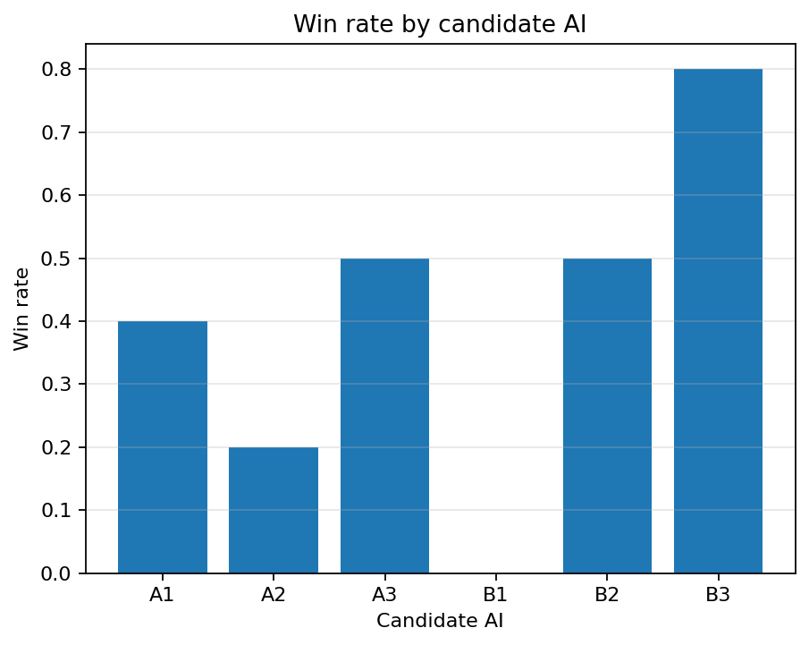
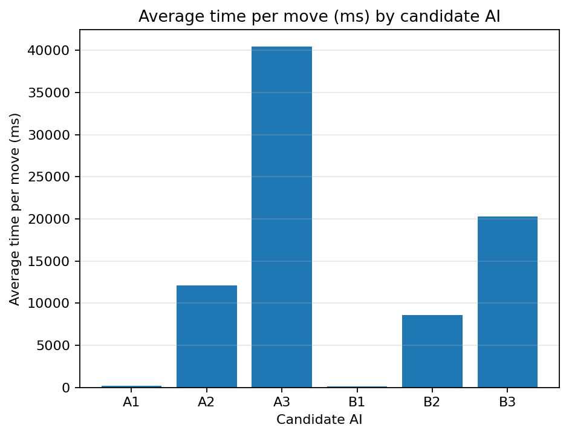
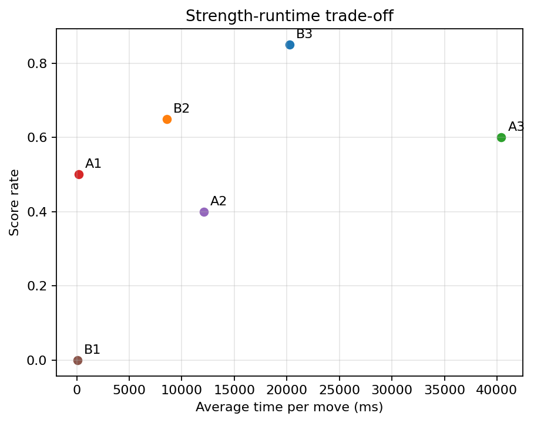

# Experiment 3 Report: Candidate AI Configuration Selection

## 1. Objective

Experiment 3 is a candidate AI selection tournament. Its goal is to compare
reasonable search/evaluation/depth combinations and identify suitable candidates
for the final Easy / Medium / Hard setup.

This experiment is a screening step, not the final formal difficulty tournament.

## 2. Candidate Selection Rationale

Experiment 1 showed that Alpha-Beta pruning with move ordering is much more
efficient than pure Minimax. Therefore, every candidate in Experiment 3 uses:

```text
Alpha-Beta + move ordering
```

Experiment 2 compared the evaluation functions. The current candidate set keeps
Eval A and Eval B across depths 1, 2, and 3.

Eval C candidates are excluded from the current run:

- `C1 = Eval C + depth 1` is excluded because depth 1 is too shallow to express
  Eval C's five-cell window potential.
- `C3 = Eval C + depth 3` is excluded because Experiment 2 showed excessive
  per-move runtime.
- Depth 4 is not tested.

## 3. Candidate Configurations

|AI|Search|Evaluation|Depth|
|---|---|---|---|
|A1|Alpha-Beta + ordering|Eval A|1|
|B1|Alpha-Beta + ordering|Eval B|1|
|A2|Alpha-Beta + ordering|Eval A|2|
|B2|Alpha-Beta + ordering|Eval B|2|
|A3|Alpha-Beta + ordering|Eval A|3|
|B3|Alpha-Beta + ordering|Eval B|3|

## 4. Tournament Protocol

The current script runs a round-robin tournament:

- 6 AIs;
- 15 pairings;
- default 10 games per pair;
- each pair swaps first player evenly;
- board size: 15x15;
- candidate generator: current project default `generate_candidate_moves(radius=2)`;
- default `max_moves = 50`;
- default workers: 4;
- if no player wins before `max_moves`, the game is recorded as draw.

The AIs are deterministic, so each repeated game with the same black AI, white
AI, and max-move cap produces the same move sequence. To keep the tournament
configuration unchanged while reducing unnecessary runtime, the script computes
each unique black/white direction once and expands it into the full repeated
game table. The output still contains 150 game rows.

Recorded metrics include:

- winner and winner AI;
- move count;
- total and average time per side;
- total and average search nodes per side;
- black/white performance;
- max-move draw status.

The script now writes directly to:

```text
experiments/experiment3_candidate_tournament/results
```

## 5. Outputs

The final result directory contains:

- `results/candidate_match_results.csv`
- `results/candidate_ai_ranking.csv`
- `results/candidate_ai_ranking.md`
- `results/candidate_pairwise_summary.csv`
- `results/candidate_win_rate.png`
- `results/candidate_avg_time.png`
- `results/candidate_strength_vs_time.png`

The old `results2` staging directory and local `.Rhistory` file have been
removed.

The main ranking is sorted by `score_rate`, then `win_rate`, then
`avg_time_per_move_ms`, then `avg_nodes_per_move`.

```text
score_rate = (wins + 0.5 * draws) / games
```

## 6. Results

The final candidate tournament was run with:

```text
candidate AIs = 6
pairings = 15
games_per_pair = 10
max_moves = 50
total games = 150
```

Overall game outcomes:

```text
Black wins: 55
White wins: 65
Draws: 30
Max-move draws: 30
Average game length: 28.17 moves
```

Black and white wins are reasonably balanced in this result set. The 30 draws
correspond to games that reached the 50-move cap.

### Main Ranking

|AI|Eval|Depth|Games|Wins|Losses|Draws|Win rate|Score rate|Avg time / move (ms)|Avg nodes / move|Black win rate|White win rate|
|---|---|---|---|---|---|---|---|---|---|---|---|---|
|B3|Eval B|3|50|40|5|5|0.8|0.85|20273.7115|3883.32|0.8|0.8|
|B2|Eval B|2|50|25|10|15|0.5|0.65|8562.2576|254.19|0.4|0.6|
|A3|Eval A|3|50|25|15|10|0.5|0.6|40418.5438|4431.65|0.6|0.4|
|A1|Eval A|1|50|20|20|10|0.4|0.5|188.2727|65.48|0.2|0.6|
|A2|Eval A|2|50|10|20|20|0.2|0.4|12109.1278|234.81|0.2|0.2|
|B1|Eval B|1|50|0|50|0|0.0|0.0|83.816|54.68|0.0|0.0|







## 7. Head-to-Head Notes

Important pairwise comparisons:

|Pair|Result|Interpretation|
|---|---|---|
|A1 vs A2|10 draws|Depth 2 did not convert the direct matchup within the 50-move cap.|
|A1 vs A3|A3 wins 10-0|Depth 3 Eval A strongly outperforms A1.|
|A1 vs B1|A1 wins 10-0|At depth 1, Eval A performs better than Eval B in this direct matchup.|
|A1 vs B2|5-5 split|Eval B depth 2 no longer dominates A1 directly after the Eval B update.|
|A1 vs B3|5-5 split|B3 also splits with A1 in this deterministic pairing.|
|A2 vs A3|A3 wins 5, draws 5|Depth 3 improves over depth 2 for Eval A.|
|A2 vs B2|B2 wins 5, draws 5|Eval B depth 2 outperforms Eval A depth 2.|
|A2 vs B3|B3 wins 10-0|B3 clearly beats A2.|
|A3 vs B3|B3 wins 10-0|Eval B depth 3 strongly outperforms Eval A depth 3.|
|B1 vs B2|B2 wins 10-0|Increasing Eval B from depth 1 to depth 2 is a major improvement.|
|B1 vs B3|B3 wins 10-0|B3 also clearly beats B1.|
|B2 vs B3|B3 wins 5, draws 5|B3 now has a direct advantage over B2, but with much higher runtime.|

## 8. Interpretation

The strongest candidate by score rate is now `B3`, with `0.85`. It also wins
the direct matchup against `B2` with five wins and five draws.

`B2` remains the best lower-depth Eval B candidate. It is much faster than `B3`
and has a strong score rate of `0.65`, but the new tournament does not show it
as the top overall candidate.

`A3` improves over the shallower Eval A candidates and scores above `A1` and
`A2`, but it is slower than `B3` while scoring lower. `A1` is still a useful
easy-level candidate because it is simple and wins several matchups. `A2` draws
many games and has weaker score rate. `B1` is very fast but loses every game in
this run.

## 9. Proposed Final Configurations

Based on this run:

- Easy: `A1`
- Medium: `B2`
- Hard: `B3`

Rationale:

- `A1` is fast and meaningfully stronger than `B1`, making it a better low-level
  candidate.
- `B2` provides a strong middle tier and is much cheaper than `B3`.
- `B3` is the strongest candidate by score rate after the Eval B rerun.

`A3` remains an alternate medium candidate if the final setup wants to preserve
an Eval A-based middle level, but its runtime is high compared with its score
rate.

## 10. How to Run

Default candidate tournament:

```bash
python experiments/experiment3_candidate_tournament/candidate_tournament.py
```

Faster smoke run:

```bash
python experiments/experiment3_candidate_tournament/candidate_tournament.py --games-per-pair 2 --max-moves 40
```

Single-worker run:

```bash
python experiments/experiment3_candidate_tournament/candidate_tournament.py --workers 1
```

Generate plots from the existing result CSV:

```bash
python experiments/experiment3_candidate_tournament/plot_candidate_tournament.py
```
