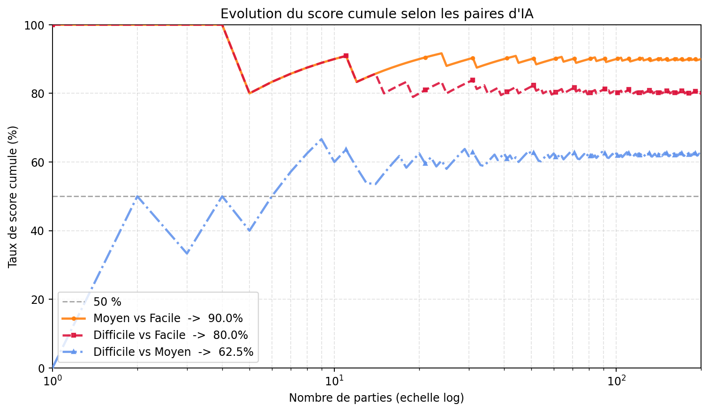
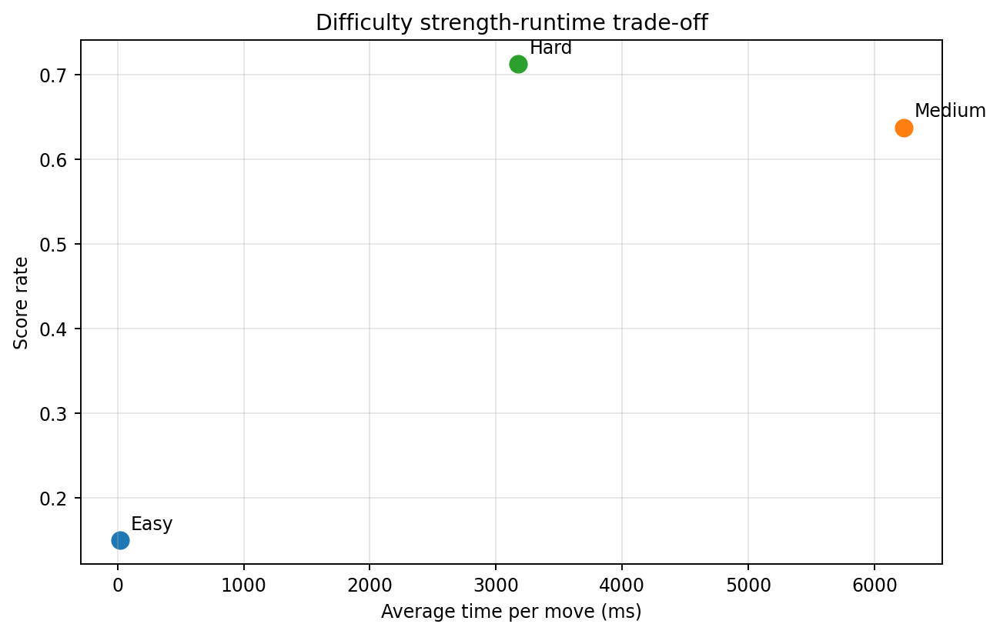
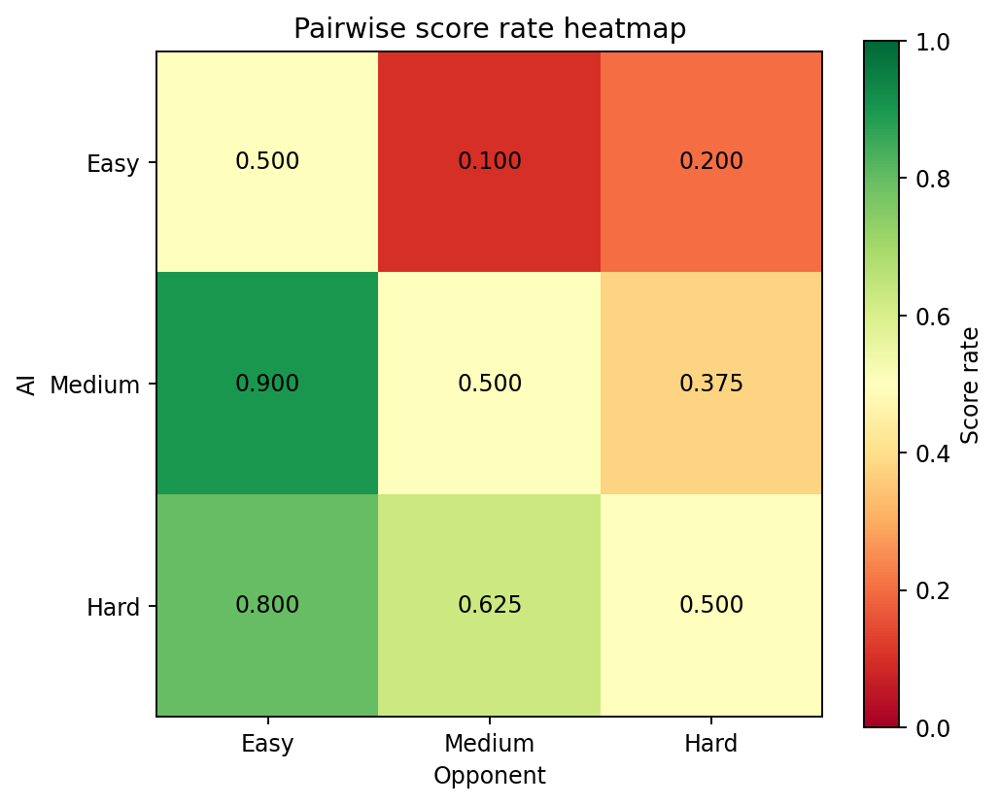
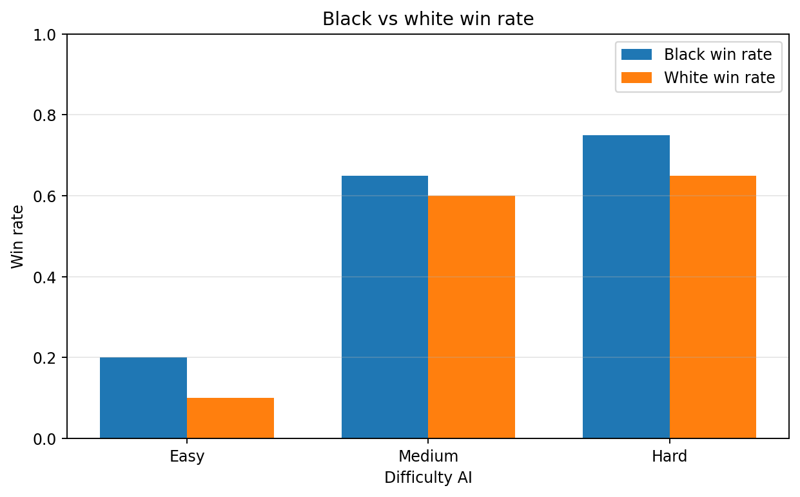

# Experiment 4 Report: Final Difficulty Tournament

## 1. Objective

Experiment 4 evaluates the final Easy / Medium / Hard AI configurations in a
larger tournament. Unlike Experiment 3, which screened candidate configurations,
this experiment uses only the selected three difficulty levels.

The goal is to check whether the final difficulty ladder behaves as expected:

- Hard should be strongest overall.
- Medium should be clearly stronger than Easy.
- Easy should remain fast and weaker.
- Runtime should remain acceptable for the intended difficulty level.

The final cleaned result directory is:

```text
experiments/experiment4_difficulty_tournament/result12
```

## 2. Final AI Configurations

|Difficulty|Profile|Search|Evaluation|Depth|Candidate radius|
|---|---|---|---|---|---|
|Easy|A1|Alpha-Beta|Eval A|1|2|
|Medium|A3|Alpha-Beta + ordering|Eval A|3|2|
|Hard|B2|Alpha-Beta + ordering|Eval B|2|3|

The final settings reflect the earlier experiments:

- Experiment 1 showed that Alpha-Beta pruning is useful.
- Experiment 2 compared evaluation functions and showed Eval B is a strong
  practical choice.
- Experiment 3 screened candidate configurations and identified A1, A3, and B2
  as the final Easy / Medium / Hard set at that time.

## 3. Tournament Protocol

The tournament uses:

- 3 difficulty AIs;
- 3 pairings: Easy vs Medium, Easy vs Hard, Medium vs Hard;
- 200 games per pair;
- 600 games total;
- fixed opening positions;
- max moves: 50;
- draw if max moves is reached.

The tournament uses fixed openings rather than one empty-board start only. This
reduces overfitting to a single deterministic game path and gives each pair a
broader set of starting conditions.

## 4. Overall Results

Overall outcomes across 600 games:

```text
Black wins: 320
White wins: 270
Draws: 10
Max-move draws: 10
Average game length: 17.57 moves
```

The low draw count indicates that most games ended before the 50-move cap. Black
still has a small advantage, but white also wins many games, so the result is
not dominated by first-player wins.

## 5. Ranking Table

|AI|Profile|Evaluation|Depth|Games|Wins|Losses|Draws|Win rate|Score rate|Avg time / move ms|Avg nodes / move|Black win rate|White win rate|
|---|---|---|---|---|---|---|---|---|---|---|---|---|---|
|Hard|B2|Eval B|2|400|280|110|10|0.7|0.7125|3175.6271|431.85|0.75|0.65|
|Medium|A3|Eval A|3|400|250|140|10|0.625|0.6375|6228.0128|5356.2|0.65|0.6|
|Easy|A1|Eval A|1|400|60|340|0|0.15|0.15|17.6245|76.49|0.2|0.1|

The ranking is ordered by score rate.

## 6. Pairwise Results

|Pair|Games|AI 1 wins|AI 2 wins|Draws|AI 1 score rate|AI 2 score rate|Interpretation|
|---|---|---|---|---|---|---|---|
|Easy vs Hard|200|40|160|0|0.2|0.8|Hard clearly outperforms Easy.|
|Easy vs Medium|200|20|180|0|0.1|0.9|Medium clearly outperforms Easy.|
|Medium vs Hard|200|70|120|10|0.375|0.625|Hard is stronger than Medium, but the gap is smaller.|

The pairwise table supports the intended difficulty ordering:

```text
Hard > Medium > Easy
```

## 7. Cumulative Score Trend



This plot tracks the cumulative score rate over games for each pairing. It is
useful because it shows whether the final result stabilizes as more games are
played.

The curves support the final ordering:

- Medium stays clearly ahead of Easy.
- Hard stays clearly ahead of Easy.
- Hard also leads Medium, though with a smaller margin.

## 8. Strength-Runtime Trade-Off



This plot compares score rate against average time per move.

Key observation:

- Easy is very fast and weak.
- Medium is stronger than Easy but is the slowest configuration.
- Hard is strongest and faster than Medium.

This is an important result: Hard is not simply the slowest AI. Hard uses Eval B
at depth 2 with a wider candidate radius, while Medium uses Eval A at depth 3.
The result suggests that better evaluation and candidate settings can outperform
deeper search with lower runtime.

## 9. Pairwise Score Heatmap



The heatmap gives a compact view of pairwise strength. Values above 0.5 mean the
row AI scores better than the column AI.

The heatmap confirms:

- Easy scores poorly against both Medium and Hard.
- Medium strongly beats Easy.
- Hard beats both Easy and Medium.

## 10. First-Player Analysis



The color win-rate plot compares black and white performance for each AI.

Current results:

```text
Easy black win rate:   0.20
Easy white win rate:   0.10
Medium black win rate: 0.65
Medium white win rate: 0.60
Hard black win rate:   0.75
Hard white win rate:   0.65
```

Black performs slightly better for all three difficulty levels, which is
expected in Gomoku-like games. However, the gap is not large enough to overturn
the main ordering.

## 11. Interpretation

The final difficulty ladder is valid according to the tournament results.

Easy is intentionally weak and fast. It loses heavily to both Medium and Hard,
which makes it appropriate as a beginner-level opponent.

Medium is much stronger than Easy, but it is slower than Hard because it uses
Eval A at depth 3. This makes Medium a useful middle level in playing strength,
but not the most efficient configuration.

Hard has the highest score rate and beats Medium directly. It also runs faster
than Medium on average, showing that the chosen Hard configuration has the best
strength-runtime trade-off among the final three.

## 12. Conclusion

Experiment 4 supports the final difficulty setup:

```text
Easy   = A1
Medium = A3
Hard   = B2
```

The tournament shows clear separation between Easy and the stronger levels, and
Hard is the strongest final configuration. The Medium-Hard gap is smaller than
the Easy-Medium gap, but Hard still wins the direct matchup and has the highest
overall score rate.

## 13. How to Reproduce

Run the tournament:

```bash
python experiments/experiment4_difficulty_tournament/tournament.py
```

Regenerate plots:

```bash
python experiments/experiment4_difficulty_tournament/plot_difficulty_tournament.py
```

Final outputs are saved in:

```text
experiments/experiment4_difficulty_tournament/result12
```
